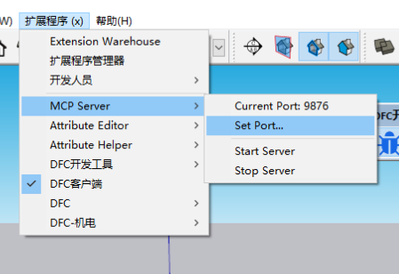

# SketchupMCP - Sketchup Model Context Protocol Integration

[简体中文](README.zh-CN.md)

SketchupMCP connects Sketchup to MCP clients such as Codex and opencode, allowing agents to directly interact with and control Sketchup. This integration enables prompt-assisted 3D modeling, scene creation, and manipulation in Sketchup.

Big Shoutout to [Blender MCP](https://github.com/ahujasid/blender-mcp) for the inspiration and structure.

## Features

* **Two-way communication**: Connect MCP clients to Sketchup through a TCP socket connection
* **Component manipulation**: Create, modify, delete, and transform components in Sketchup
* **Material control**: Apply and modify materials and colors
* **Scene inspection**: Get detailed information about the current Sketchup scene
* **Selection handling**: Get and manipulate selected components
* **Ruby code evaluation**: Execute arbitrary Ruby code directly in SketchUp for advanced operations

## Components

The system consists of two main components:

1. **Sketchup Extension**: A Sketchup extension that creates a TCP server within Sketchup to receive and execute commands
2. **MCP Server (`sketchup_mcp/server.py`)**: A Python server that implements the Model Context Protocol and connects to the Sketchup extension

## Installation

### Python MCP Server

Install `uv` first, then either run the MCP server directly with `uvx`:

```powershell
uvx sketchup-mcp
```

Or install this checkout for local development:

```powershell
cd H:\sketchup-mcp
uv pip install -e .
```

After local installation, activate the virtual environment before running the
entry-point commands directly:

```powershell
.\.venv\Scripts\Activate.ps1
sketchup-mcp
sketchup-mcp-cli --help
```

Without activating the virtual environment, run the local checkout through
`uvx --from .`:

```powershell
uvx --from . sketchup-mcp-cli --help
```

### Sketchup Extension

1. Download or build the latest `.rbz` file
2. In Sketchup, go to Window > Extension Manager
3. Click "Install Extension" and select the downloaded `.rbz` file
4. Restart Sketchup

## MCP Client Configuration

SketchupMCP supports both a shared Streamable HTTP service and the original
stdio server. Both transports connect to the SketchUp Ruby extension over local
TCP. For Codex, prefer the shared HTTP service described below.

### Recommended: shared Streamable HTTP service for Codex

A stdio MCP process owns one host session's input/output pipe. Multiple Codex
tasks cannot share the same stdio process, so a task-per-stdio configuration can
create duplicate SketchUp MCP Python processes. Use the long-running Streamable
HTTP service at `http://127.0.0.1:8765/mcp` when several Codex tasks need the
same local SketchUp MCP bridge.

Keep the bearer token in the user-scoped environment variable
`SKETCHUP_MCP_HTTP_TOKEN`; never put the token itself in `config.toml`. The
login scheduled task and the HTTP daemon lifecycle are managed by
`scripts/manage-http-daemon.ps1`.

#### Windows daemon management

Run these commands from the repository root in PowerShell. `Install` creates
or updates the current user's logon scheduled task and starts the daemon; its
default is `-AllowAutostart:$true`.

```powershell
.\scripts\manage-http-daemon.ps1 Install
.\scripts\manage-http-daemon.ps1 Status
.\scripts\manage-http-daemon.ps1 Restart
.\scripts\manage-http-daemon.ps1 RotateToken
.\scripts\manage-http-daemon.ps1 Uninstall
.\scripts\manage-http-daemon.ps1 Uninstall -RemoveToken
```

With the default `Install`, any local client that holds a valid bearer token
can trigger SketchUp autostart through the HTTP service. Disable that
pre-approval when this is not acceptable:

```powershell
.\scripts\manage-http-daemon.ps1 Install -AllowAutostart:$false
```

`RotateToken` replaces the user-scoped bearer token and restarts the daemon.
The scheduled-task runner reloads the current user-scoped token on every start,
so it does not reuse the task engine's older process environment.
Restart Codex afterwards so it reads the replacement token. The daemon log is
`%LOCALAPPDATA%\SketchUpMCP\logs\http-daemon.log`, rotated at 5 MiB with five
retained files. Session state is removed immediately after a normal HTTP
`DELETE` close; an unexpectedly disconnected session is reclaimed after 1800
seconds of inactivity.

Codex reads MCP servers from `~/.codex/config.toml`, or from a project-scoped
`.codex/config.toml` when the project is trusted. Add the HTTP entry (or first
add it under a temporary name during migration):

```toml
[mcp_servers.sketchup_2022]
url = "http://127.0.0.1:8765/mcp"
bearer_token_env_var = "SKETCHUP_MCP_HTTP_TOKEN"
startup_timeout_sec = 20
tool_timeout_sec = 300
required = false

[mcp_servers.sketchup_2022.tools.eval_ruby]
approval_mode = "approve"
```

Restart Codex after changing its MCP configuration or the user environment. For
a safe migration, first use a temporary HTTP server name and verify it, then
switch the normal entry to HTTP. Only after that verification, clean up the old
stdio process tree whose executable and launch arguments exactly match the old
configuration. Do not terminate the shared HTTP daemon or unrelated MCP
processes.

To roll back in the safe order, restore the stdio configuration and restart
Codex first, then run `Uninstall` to remove the resident scheduled task. Keep
the token unless it must be removed; only then run `Uninstall -RemoveToken`.

HTTP keeps state isolated per MCP session. Target-port selection is resolved in
this order: an explicit tool `port`, then that session's default set through
`set_connection_port`, then the service default port `9876`. Calls to the same
resolved port are serialized; calls to different ports can run in parallel.
The HTTP service does not use an idle watchdog.

This change addresses duplicate **SketchUp MCP** processes only. It does not
start, stop, share, or deduplicate other MCP services such as Chrome, IDA, or
PPT.

### Legacy stdio: compatibility and rollback

The original stdio transport remains available for compatibility and rollback.
It starts one Python process per MCP host session, so do not attempt to share a
single stdio instance across multiple Codex tasks.

```toml
[mcp_servers.sketchup]
command = "uvx"
args = ["sketchup-mcp"]
startup_timeout_sec = 20
tool_timeout_sec = 300

[mcp_servers.sketchup.env]
SKETCHUP_MCP_PORT = "9876"
```

By default, the legacy stdio server will not open Sketchup on its own. If the
Ruby port is not reachable, the tool response tells the agent to ask the user whether it may start Sketchup.
After the user agrees, call `allow_sketchup_autostart`, then retry the Sketchup
tool call.

To pre-approve Sketchup startup for this MCP server, add the autostart
environment variables:

```toml
[mcp_servers.sketchup.env]
SKETCHUP_MCP_PORT = "9876"
SKETCHUP_MCP_AUTOSTART = "1"
SKETCHUP_MCP_SKETCHUP_EXE = "C:\\Program Files\\SketchUp\\SketchUp 2026\\SketchUp.exe"
SKETCHUP_MCP_STARTUP_TIMEOUT = "45"
SKETCHUP_MCP_REQUEST_TIMEOUT_MS = "15000"
SKETCHUP_MCP_IDLE_TIMEOUT_SEC = "0"
```

Autostart runs only after the user has approved it, either through
`allow_sketchup_autostart` in the current MCP process or through the
`SKETCHUP_MCP_AUTOSTART=1` pre-approval setting. An explicit tool `port` only
starts that requested SketchUp instance; it never falls back to another port.

Every Python-to-Sketchup request includes a send timestamp and
`SKETCHUP_MCP_REQUEST_TIMEOUT_MS`. If Sketchup is busy and only handles the
socket after that timeout has elapsed, the Ruby extension drops the stale
request without executing it.

`SKETCHUP_MCP_IDLE_TIMEOUT_SEC` applies only to the legacy stdio process. It
controls how long that unused process can stay alive after its last SketchUp
command. It defaults to `0`, which keeps the bridge alive and disables the idle
watchdog. The shared HTTP service does not use this watchdog.

`SKETCHUP_MCP_PORT` is only the default target. One MCP entry can route each
tool call to any explicitly supplied local SketchUp port, so extra MCP entries
are no longer required for normal multi-instance work.

### opencode

opencode can use either `opencode mcp add` or an `opencode.json` config file.
For a project-local setup, create `opencode.json` in the project root:

```json
{
  "$schema": "https://opencode.ai/config.json",
  "mcp": {
    "sketchup": {
      "type": "local",
      "command": ["uvx", "sketchup-mcp"],
      "enabled": true,
      "environment": {
        "SKETCHUP_MCP_PORT": "9876",
        "SKETCHUP_MCP_AUTOSTART": "1",
        "SKETCHUP_MCP_SKETCHUP_EXE": "C:\\Program Files\\SketchUp\\SketchUp 2026\\SketchUp.exe",
        "SKETCHUP_MCP_REQUEST_TIMEOUT_MS": "15000"
      }
    }
  }
}
```

For multiple Sketchup instances, keep one local MCP entry. Give each SketchUp
window a distinct Ruby listener port, then include `port` in the MCP tool call
that targets that window.

## Usage

### Starting the Connection

1. Load the extension in SketchUp. The Ruby listener starts automatically.
2. It tries port `9876`, then increments until it can bind an available port.
3. Use Extensions > MCP Server > Current Port to see the selected port.
4. Start Codex, opencode, or another configured MCP client.

Use the Sketchup `Extensions > MCP Server` menu as the local server control
panel. `Start Server` starts the Ruby-side TCP listener again after it has been
stopped, `Stop Server` pauses it, `Current Port` shows the active listener port,
and `Set Port...` changes the port before a manual start. Assign each Sketchup
instance a different port when several models must be controlled at once.



### Using Multiple Sketchup Instances

Each Sketchup instance runs its own local TCP server. To connect multiple
instances at the same time, give each Sketchup instance a different port:

1. Load the extension in each SketchUp instance. Each listener automatically
   selects the first available port starting at `9876`.
2. Use the Current Port menu item to confirm each active port.
3. To choose a port manually, stop the server, use Extensions > MCP Server >
   Set Port..., then use Extensions > MCP Server > Start Server.
4. In the MCP conversation, call `list_sketchup_instances` to confirm the
   running windows, or use the known port directly.

Every SketchUp tool accepts an optional `port`. For example, use
`eval_ruby(code="Sketchup.active_model.title", port=9877)` or
`get_selection(port=9876)`. The explicit port is request-scoped, so concurrent
commands can target separate SketchUp windows without changing each other's
default. `set_connection_port` remains available only as a default for calls
that omit `port`.

`list_sketchup_instances` checks registered listeners and any ports explicitly
provided through `ports=[...]`. Identity checks run concurrently, use a
2-second read-only timeout with no retries, and never start SketchUp. A listener
that does not respond is returned under `unavailable`; discovery does not scan
arbitrary ports or fall back to a different instance.

### Direct CLI

For debugging or scripting, use `sketchup-mcp-cli` to call the Sketchup Ruby
extension directly without going through an MCP host:

```powershell
sketchup-mcp-cli --port 9877 ping
sketchup-mcp-cli --port 9877 eval "Sketchup.active_model.title"
sketchup-mcp-cli --port 9877 eval --prevent-modal-hang "UI.messagebox('confirm?')"
sketchup-mcp-cli --port 9877 eval --file .\probe.rb
sketchup-mcp-cli --port 9877 modal-state
sketchup-mcp-cli --port 9877 close-modal
sketchup-mcp-cli --port 9877 call get_selection
sketchup-mcp-cli --port 9877 --start-sketchup-if-needed --sketchup-exe "C:\Program Files\SketchUp\SketchUp 2026\SketchUp.exe" ping
```

Use `eval --file` for larger Ruby snippets or when shell quoting would make an
inline string fragile.

Use `eval --prevent-modal-hang` only for non-interactive automation runs that
must not block on Sketchup UI. It sends `prevent_modal_hang: true` for that
single `eval_ruby` call, returns `nil` from file/input dialogs, chooses safe
cancel/no answers for message boxes when available, and may interrupt a detected
Sketchup-owned modal window after a request timeout.

Use `modal-state` after an eval timeout to inspect whether the configured local
SketchUp process currently has a modal window. Use `close-modal` to close
detected modal windows, repeating through a short bounded attempt loop in case a
dialog has multiple owned wrapper windows. Both commands operate only on the
SketchUp process that owns the configured localhost listener port.

Once connected, Codex, opencode, or another MCP client can interact with Sketchup using the following capabilities:

#### Tools

* `get_selection` - Gets information about currently selected components
* `allow_sketchup_autostart` - Allow this MCP process to start Sketchup after the user approves
* `set_connection_port` - Set the default Sketchup Ruby TCP port for calls that omit `port`
* `get_instance_info` - Read a target instance's PID, port, SketchUp version, model, and page
* `list_sketchup_instances` - Concurrently check registered or explicitly supplied listeners without scanning arbitrary ports or starting SketchUp
* `get_modal_state` - Inspect whether the target SketchUp process has a modal window
* `close_modal` - Close a detected modal window owned by the target SketchUp process
* `create_component` - Create a new component with specified parameters
* `delete_component` - Remove a component from the scene
* `transform_component` - Move, rotate, or scale a component
* `set_material` - Apply materials to components
* `export_scene` - Export the current scene to various formats
* `capture_review_views` - Capture front, right, and top review images for a top-level entity
* `create_mortise_tenon` - Create a mortise and tenon joint between two boards
* `create_dovetail` - Create a dovetail joint between two boards
* `create_finger_joint` - Create a finger joint between two boards
* `eval_ruby` - Execute arbitrary Ruby code in SketchUp for advanced operations

### Example Commands

Here are some examples of what you can ask your MCP client to do:

* "Create a simple house model with a roof and windows"
* "Select all components and get their information"
* "Make the selected component red"
* "Move the selected component 10 units up"
* "Export the current scene as a 3D model"
* "Create a complex arts and crafts cabinet using Ruby code"

## Troubleshooting

* **Connection issues**: Make sure both the Sketchup extension server and the MCP server are running
* **Command failures**: Check the Ruby Console in Sketchup for error messages
* **Timeout errors**: Try simplifying your requests or breaking them into smaller steps

## Technical Details

### Communication Protocol

The Python connector and Sketchup Ruby extension exchange JSON-RPC payloads over
TCP sockets:

* New requests and responses use `Content-Length: <bytes>\r\n\r\n<json>` framing.
* The Ruby extension still accepts legacy one-line JSON requests for compatibility.
* Requests include `_mcp.sent_at_ms` and `_mcp.timeout_ms`; expired requests are
  dropped by the Ruby extension before tool dispatch.

## Contributing

Contributions are welcome! Please feel free to submit a Pull Request.

## License

MIT 
