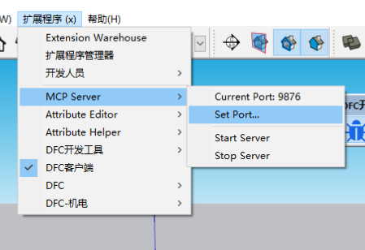

# SketchupMCP - SketchUp Model Context Protocol 集成

[English](README.md)

SketchupMCP 用于连接 SketchUp 和 Codex、opencode 等 MCP 客户端，让智能体可以直接检查、控制和操作 SketchUp。它支持通过提示词辅助建模、场景创建、组件编辑和 Ruby 自动化。

感谢 [Blender MCP](https://github.com/ahujasid/blender-mcp) 提供的项目思路和结构参考。

## 功能特性

* **双向通信**：通过本地 TCP socket 连接 MCP 客户端和 SketchUp。
* **组件操作**：创建、修改、删除和变换 SketchUp 组件。
* **材质控制**：应用和修改材质、颜色。
* **场景检查**：读取当前 SketchUp 场景的详细信息。
* **选择集处理**：读取和操作当前选中的组件。
* **Ruby 代码执行**：直接在 SketchUp 内执行任意 Ruby 代码，支持高级自动化。
* **模态窗口诊断**：检测和关闭当前 SketchUp 进程下的模态窗口，辅助处理 `eval_ruby` 超时。

## 组成

项目包含两个主要部分：

1. **SketchUp 扩展**：在 SketchUp 内启动一个 Ruby TCP server，用于接收并执行命令。
2. **MCP Server (`sketchup_mcp/server.py`)**：Python MCP server，通过本地 TCP 连接到 SketchUp 扩展。

## 安装

### Python MCP Server

先安装 `uv`，然后可以直接通过 `uvx` 运行 MCP server：

```powershell
uvx sketchup-mcp
```

也可以在本地开发环境中安装当前 checkout：

```powershell
cd H:\sketchup-mcp
uv pip install -e .
```

本地安装后，如果要直接使用入口命令，先激活虚拟环境：

```powershell
.\.venv\Scripts\Activate.ps1
sketchup-mcp
sketchup-mcp-cli --help
```

如果不激活虚拟环境，可以从当前 checkout 通过 `uvx --from .` 运行：

```powershell
uvx --from . sketchup-mcp-cli --help
```

### SketchUp 扩展

1. 下载或构建最新的 `.rbz` 文件。
2. 在 SketchUp 中打开 Window > Extension Manager。
3. 点击 "Install Extension"，选择下载好的 `.rbz` 文件。
4. 重启 SketchUp。

## MCP 客户端配置

SketchupMCP 是一个 stdio MCP server。MCP 客户端会启动 Python 进程，Python 进程再通过本地 TCP 连接到 SketchUp Ruby 扩展。

### Codex

Codex 会读取 `~/.codex/config.toml` 中的 MCP server 配置；如果项目已被信任，也可以使用项目内 `.codex/config.toml`。

```toml
[mcp_servers.sketchup]
command = "uvx"
args = ["sketchup-mcp"]
startup_timeout_sec = 20
tool_timeout_sec = 300

[mcp_servers.sketchup.env]
SKETCHUP_MCP_PORT = "9876"
```

默认情况下，MCP server 不会自行打开 SketchUp。如果 Ruby 端口不可达，工具响应会提示智能体询问用户是否允许启动 SketchUp。用户同意后，先调用 `allow_sketchup_autostart`，再重试 SketchUp 工具调用。

如果希望预先允许这个 MCP server 启动 SketchUp，可以添加自动启动环境变量：

```toml
[mcp_servers.sketchup.env]
SKETCHUP_MCP_PORT = "9876"
SKETCHUP_MCP_AUTOSTART = "1"
SKETCHUP_MCP_SKETCHUP_EXE = "C:\\Program Files\\SketchUp\\SketchUp 2026\\SketchUp.exe"
SKETCHUP_MCP_STARTUP_TIMEOUT = "45"
SKETCHUP_MCP_REQUEST_TIMEOUT_MS = "15000"
SKETCHUP_MCP_IDLE_TIMEOUT_SEC = "0"
```

自动启动只会在用户已批准后生效：要么通过当前 MCP 进程中的 `allow_sketchup_autostart` 批准，要么通过 `SKETCHUP_MCP_AUTOSTART=1` 预先批准。工具显式传入 `port` 时，只会尝试启动该端口对应的 SketchUp，绝不会回退到其他端口。

每个 Python 到 SketchUp 的请求都会包含发送时间戳和 `SKETCHUP_MCP_REQUEST_TIMEOUT_MS`。如果 SketchUp 正忙，直到超时后才处理 socket，请求会被 Ruby 扩展丢弃，不会继续执行过期命令。

`SKETCHUP_MCP_IDLE_TIMEOUT_SEC` 控制空闲 stdio MCP 进程在最后一次 SketchUp 命令后可以存活多久。默认值为 `0`，即保持 bridge 常驻并关闭空闲 watchdog。只有当 MCP host 能自动重启过期 bridge 时才应设置正数；否则 watchdog 退出进程后，host 可能提示 `Transport closed`。

`SKETCHUP_MCP_PORT` 只定义默认目标端口。一个 MCP server 已可按每次工具调用的显式 `port` 路由到不同的本机 SketchUp，因此日常多实例操作不再需要为每个端口额外配置 MCP server。

### opencode

opencode 可以通过 `opencode mcp add` 或 `opencode.json` 配置 MCP。项目本地配置可以在项目根目录创建 `opencode.json`：

```json
{
  "$schema": "https://opencode.ai/config.json",
  "mcp": {
    "sketchup": {
      "type": "local",
      "command": ["uvx", "sketchup-mcp"],
      "enabled": true,
      "environment": {
        "SKETCHUP_MCP_PORT": "9876",
        "SKETCHUP_MCP_AUTOSTART": "1",
        "SKETCHUP_MCP_SKETCHUP_EXE": "C:\\Program Files\\SketchUp\\SketchUp 2026\\SketchUp.exe",
        "SKETCHUP_MCP_REQUEST_TIMEOUT_MS": "15000"
      }
    }
  }
}
```

多个 SketchUp 实例只需保留一个本地 MCP 入口。给每个 SketchUp 窗口分配不同的 Ruby listener 端口，然后在对应 MCP 工具调用中传入 `port`。

## 使用

### 启动连接

1. 在 SketchUp 中打开 Extensions > MCP Server > Start Server。
2. server 会在默认端口 `9876` 上启动。
3. 启动 Codex、opencode 或其他已配置的 MCP 客户端。

SketchUp 的 `Extensions > MCP Server` 菜单是本地 server 控制面板。`Start Server` 启动 Ruby 侧 TCP listener，`Stop Server` 暂停服务，`Current Port` 显示当前监听端口，`Set Port...` 可以在启动前修改端口。多实例场景下，给每个 SketchUp 实例分配不同端口即可。



### 使用多个 SketchUp 实例

每个 SketchUp 实例都会运行自己的本地 TCP server。要同时连接多个实例，需要给每个 SketchUp 实例设置不同端口：

1. 在 SketchUp 中打开 Extensions > MCP Server > Set Port...
2. 输入一个端口，例如 `9876`、`9877` 或 `9878`。
3. 使用 Current Port 菜单项确认当前端口。
4. 通过 Extensions > MCP Server > Start Server 启动 server。
5. 在 MCP 对话中调用 `list_sketchup_instances` 确认已运行窗口，或直接使用已知端口。

所有 SketchUp 工具都支持可选 `port`。例如调用
`eval_ruby(code="Sketchup.active_model.title", port=9877)` 或
`get_selection(port=9876)`。显式端口只作用于本次请求，因此不同 SketchUp 窗口可以并发处理而不会改写彼此默认目标。`set_connection_port` 保留为未传 `port` 时的默认端口设置。

`list_sketchup_instances` 会检查已注册的 listener，以及通过 `ports=[...]`
显式传入的端口。各端口的身份探针并行执行，采用 2 秒只读超时、不重试，
也不会自动启动 SketchUp。无响应 listener 会进入 `unavailable`；发现过程
不会盲扫任意端口，也不会回退到其他实例。

### 直接使用 CLI

调试或脚本化调用时，可以使用 `sketchup-mcp-cli` 直接调用 SketchUp Ruby 扩展，不需要经过 MCP host：

```powershell
sketchup-mcp-cli --port 9877 ping
sketchup-mcp-cli --port 9877 eval "Sketchup.active_model.title"
sketchup-mcp-cli --port 9877 eval --prevent-modal-hang "UI.messagebox('confirm?')"
sketchup-mcp-cli --port 9877 eval --file .\probe.rb
sketchup-mcp-cli --port 9877 modal-state
sketchup-mcp-cli --port 9877 close-modal
sketchup-mcp-cli --port 9877 call get_selection
sketchup-mcp-cli --port 9877 --start-sketchup-if-needed --sketchup-exe "C:\Program Files\SketchUp\SketchUp 2026\SketchUp.exe" ping
```

较长 Ruby 片段或 shell 引号容易出错时，优先使用 `eval --file`。

`eval --prevent-modal-hang` 只建议用于必须避免 SketchUp UI 阻塞的非交互自动化场景。它会给单次 `eval_ruby` 发送 `prevent_modal_hang: true`，让文件/输入类对话框返回 `nil`，让消息框选择安全的取消或否定结果，并且在请求超时后可能中断检测到的 SketchUp 所属模态窗口。

`modal-state` 可在 eval 超时后检查当前配置的本地 SketchUp 进程是否存在模态窗口。`close-modal` 用于关闭检测到的模态窗口；如果某个对话框包含多层 owned wrapper window，会在短的有界循环内重复尝试关闭。两个命令都只会作用于拥有当前 localhost listener 端口的 SketchUp 进程。

连接成功后，Codex、opencode 或其他 MCP 客户端可以使用以下能力与 SketchUp 交互。

#### 工具

* `get_selection` - 获取当前选中组件的信息。
* `allow_sketchup_autostart` - 用户批准后，允许当前 MCP 进程启动 SketchUp。
* `set_connection_port` - 设置未传 `port` 时使用的默认 SketchUp Ruby TCP 端口。
* `get_instance_info` - 读取目标实例的 PID、端口、SketchUp 版本、模型和页面。
* `list_sketchup_instances` - 并行检查已注册或显式传入的 listener，不会盲扫任意端口或自动启动 SketchUp。
* `get_modal_state` - 检查目标 SketchUp 进程是否存在模态窗口。
* `close_modal` - 关闭目标 SketchUp 进程下检测到的模态窗口。
* `create_component` - 按指定参数创建新组件。
* `delete_component` - 从场景中删除组件。
* `transform_component` - 移动、旋转或缩放组件。
* `set_material` - 给组件应用材质。
* `export_scene` - 将当前场景导出为多种格式。
* `capture_review_views` - 为顶层实体捕获前视、右视和俯视审查图片。
* `create_mortise_tenon` - 在两块板件之间创建榫卯连接。
* `create_dovetail` - 在两块板件之间创建燕尾榫连接。
* `create_finger_joint` - 在两块板件之间创建指接连接。
* `eval_ruby` - 在 SketchUp 中执行任意 Ruby 代码，用于高级操作。

### 示例命令

可以向 MCP 客户端提出类似请求：

* "Create a simple house model with a roof and windows"
* "Select all components and get their information"
* "Make the selected component red"
* "Move the selected component 10 units up"
* "Export the current scene as a 3D model"
* "Create a complex arts and crafts cabinet using Ruby code"

## 故障排查

* **连接问题**：确认 SketchUp 扩展 server 和 Python MCP server 都在运行。
* **命令失败**：检查 SketchUp Ruby Console 中的错误信息。
* **超时错误**：尝试简化请求，或拆成多个更小的步骤。
* **`eval_ruby` 后无响应**：使用 `modal-state` 检查是否进入模态窗口状态；必要时使用 `close-modal` 关闭当前 SketchUp PID 下检测到的模态窗口。

## 技术细节

### 通信协议

Python connector 和 SketchUp Ruby 扩展通过 TCP socket 交换 JSON-RPC payload：

* 新请求和响应使用 `Content-Length: <bytes>\r\n\r\n<json>` framing。
* Ruby 扩展仍兼容旧的一行 JSON 请求格式。
* 请求包含 `_mcp.sent_at_ms` 和 `_mcp.timeout_ms`；过期请求会在 Ruby 扩展 dispatch tool 前被丢弃。

## 贡献

欢迎提交 Pull Request。

## License

MIT
